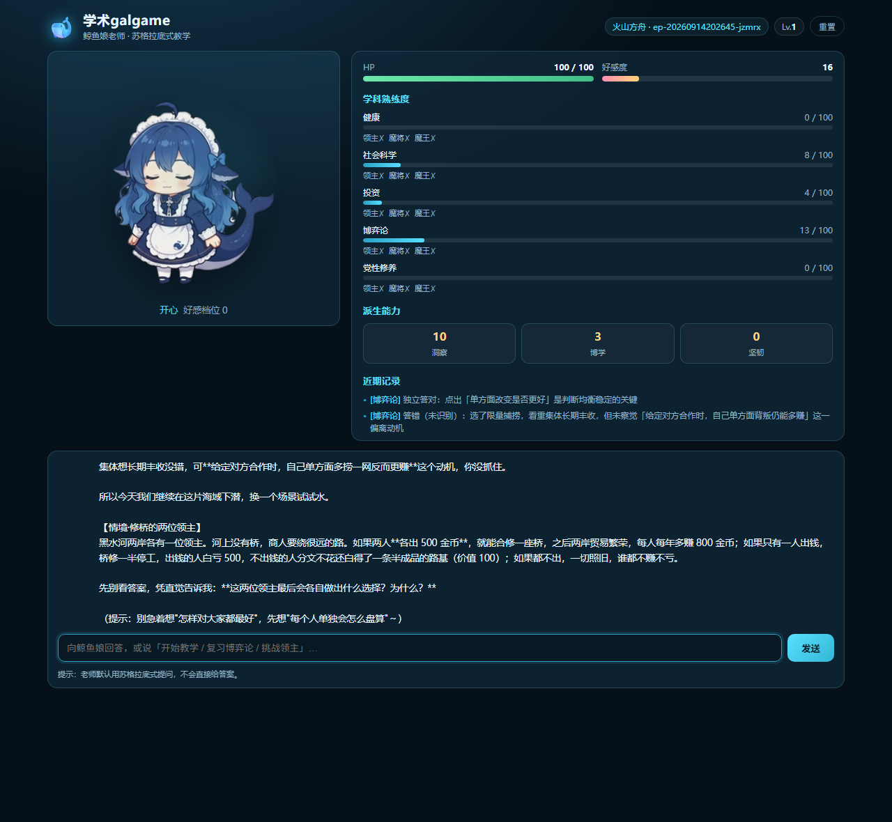

# 学术galgame Agent 🐋

> **学习优先的 AI 教学 galgame Agent**：LLM 扮演「鲸鱼娘」老师，用**苏格拉底式提问**带你自己发现答案，而不是直接讲解；学习成果量化为游戏数值（学科熟练度 / 好感度 / HP / 任务链），逐科讨伐 BOSS，最终挑战不可战胜的全知魔神。
>
> 鲸鱼娘老师的学术galgame —— 苏格拉底式情境教学（领主求助 / 魔将讨伐 / 学科魔王），配合 ima 知识库检索与答题结算（熟练度 / 好感 / HP），深读学科到「研究生」挑战全知魔神。

[](./LICENSE)
[](https://nodejs.org)
[](./package.json)
[](#在-trae-中使用)

- 🧠 **AI Agent 项目**：标准的 Agent 结构（人设 / 工具 / 编排），可直接用 Trae 打开、改、开源。
- 🇨🇳 **火山引擎原生**：模型后端走**火山方舟（Volcengine Ark）**的 OpenAI 兼容接口。
- 📦 **零依赖**：只用 Node 内置模块，`git clone` 即可运行，无 `npm install`。
- 🎓 **不是聊天机器人**：有真实的学习闭环——提问 → 判定 → 熟练度 → 间隔复习 → BOSS 战。
- 🎨 **自带 UI**：原生 HTML/CSS/JS 的 galgame 界面（立绘逐帧动画 / 属性面板 / 战斗浮层）。



> 上图是**接上火山方舟真模型**后的实际界面：右上角显示当前模型接入点，左侧鲸鱼娘立绘逐帧动画，右侧是学科熟练度/任务链/近期判定（都由模型真实作答后写入），底部是老师抛出的苏格拉底式情境提问。

---

## 目录

- [它是什么](#它是什么)
- [快速开始](#快速开始)
- [🌐 在线体验 / 部署](#-在线体验--部署)
- [在 Trae 中使用](#在-trae-中使用)
- [玩法](#玩法)
- [苏格拉底式教学](#苏格拉底式教学)
- [项目结构](#项目结构)
- [架构](#架构)
- [HTTP 接口](#http-接口)
- [配置项](#配置项)
- [常见问题](#常见问题)
- [开源协议与致谢](#开源协议与致谢)

---

## 它是什么

一个**学习优先**的学术 RPG。你不是在和一个聊天机器人对话，而是在和一位**坚持不直接给答案**的老师过招：

1. 老师先抛一个开放情境问题，逼你自己推。
2. 你答对 → 熟练度大步涨；答错 → 老师降难度给提示，并把知识点记进「近期重点」。
3. 某学科熟练度达标 → 解锁该地区的场景任务：**领主求助 → 讨伐魔将 → 讨伐学科魔王**。
4. 全科魔王通关 = 称号「研究生」→ 解锁**魔神**（无限血、不可战胜，象征学无止境）。

**学习是硬目标，游戏只是外衣**：数值改动只服务于「真实掌握」。

## 快速开始

### 1. 准备

- Node.js **≥ 18**（用到全局 `fetch`）
- 一个**火山方舟** API Key：在 [火山方舟控制台](https://console.volcengine.com/ark) 创建 API Key，并创建一个**在线推理接入点**拿到 `ep-xxxxxxxx` 形式的接入点 ID

> 📖 **不知道这两个值怎么拿？** 看 [`docs/API-KEYS.md`](./docs/API-KEYS.md) —— 有控制台逐步操作、免费额度说明、报错对照表和安全规范。

### 2. 配置

```bash
git clone https://github.com/ambitionhigh/academic-galgame-agent.git
cd academic-galgame-agent
cp .env.example .env
```

编辑 `.env`（**这是唯一填写密钥的地方**，该文件已被 gitignore）：

```ini
ARK_API_KEY=你的方舟 API Key
ARK_MODEL=你的推理接入点 ID 或模型名
# ARK_BASE_URL 默认即 https://ark.cn-beijing.volces.com/api/v3
```

### 3. 自检

```bash
npm run check:ark
```

这一步会**直接调用一次方舟**，明确告诉你 Key / 接入点 / 网络哪一环有问题：

```
✓ 调用成功！模型返回： "收到"
```

### 4. 运行

```bash
npm start          # 等同 node src/server/server.js
# 打开 http://127.0.0.1:8787
```

> **没有 API Key 也能跑**：未配置 `ARK_API_KEY` / `ARK_MODEL` 时自动进入 **DEMO 模式**——内置示例老师的苏格拉底提问，UI 与引擎（数值/战斗/存档）全部照常工作，方便先看效果或做 UI 开发。

### 5. 离线自测（可选）

```bash
npm run smoke      # 引擎 + 检索 + 会话的 12 项离线自测，不联网、不花 token
```

---

## 🌐 在线体验 / 部署

本项目**零依赖、自带 DEMO 模式**，因此非常适合部署成公开的在线体验：

> **未配置任何 API Key 时自动进入 DEMO 模式** —— UI、引擎、数值、战斗、存档全部照常工作，只是老师的提问来自内置示例。
> 这意味着你可以公开部署而**完全不暴露任何密钥**。

### 方式一：Render 一键部署（推荐，免费）

1. 用 GitHub 登录 [Render](https://render.com)
2. **New → Blueprint** → 选择本仓库
3. Render 会自动读取仓库里的 [`render.yaml`](./render.yaml)，点 **Deploy**
4. 等 1~2 分钟，拿到形如 `https://academic-galgame-agent.onrender.com` 的公开地址

无需填任何环境变量。若想让它用**真模型**（不建议公开部署时这么做，等于把你的 Key 给所有人用），在 Render 的环境变量里加 `ARK_API_KEY` / `ARK_MODEL`。

### 方式二：Docker（任意容器平台）

```bash
docker build -t academic-galgame-agent .
docker run -p 8787:8787 -e HOST=0.0.0.0 academic-galgame-agent
# 打开 http://localhost:8787
```

仓库自带 [`Dockerfile`](./Dockerfile)，零依赖故镜像极小、启动极快；健康检查端点为 `/api/health`。

### 方式三：本机运行

```bash
npm start        # 打开 http://127.0.0.1:8787
```

> ⚠️ **公开部署的已知限制**：当前为单实例共享存档，多个访客会操作同一份进度。若需要「每个访客独立存档」，需要引入按会话隔离（可提 issue）。

---

## 在 Trae 中使用

本项目按 **Trae** 的项目约定组织，导入即用：

| Trae 概念 | 本项目位置 | 说明 |
|---|---|---|
| **项目规则** | `.trae/rules/` | `project-rules.md`（始终生效，技术栈/分层约束）、`game-design.md`（改数值时生效）、`git-commit-message.md`（提交信息规范） |
| **项目技能** | `.trae/skills/socratic-questioning/SKILL.md` | 苏格拉底式提问技能，Trae 会按需自动加载 |
| **Agent 指令** | `AGENTS.md` | 项目级 agent 指令（跨 IDE 可复用） |
| **兼容目录** | `.agents/skills/` | 支持 [Agent Skills](https://agentskills.io) 规范的工具可直接读取 |

**用法**：用 Trae 打开本文件夹 → 在 **设置 > 规则 > 导入设置** 里打开「将 AGENTS.md 包含在上下文中」→ 直接对话即可，例如：

- 「帮我按苏格拉底式提问设计一节『纳什均衡』的教学」
- 「给战斗系统加一个『道具』机制，数值改动同步到规则文档」
- 「用 socratic-questioning 技能改进老师追问的措辞」

> 想让 Trae 里的 agent 在教学相关改动上严格遵守提问方法，只需在需求里提一句「用苏格拉底技能」，或让规则自动命中。

---

## 玩法

### 双轨

- **日常任务**（间隔重复 + 熟练度）：复习到期知识点 / 学习新知识点，不限时，可反复刷熟练度。
- **场景任务**（完整剧情 + 考试推进）：学科熟练度达标后，由玩家主动开战。

### 数值

| 数值 | 范围 | 说明 |
|---|---|---|
| 学科熟练度 | 0~100 | 核心成长数值 |
| 等级 | — | `1 + floor(总熟练度 / 50)`，连续成长感 |
| 好感度 | 0~100 | 鲸鱼娘 5 档表情（0/20/40/60/80） |
| HP | 0~100 | 战斗中的生命值；濒死触发营救特训 |
| 派生能力 | 0~100 | `洞察 / 博学 / 坚韧`，由各学科熟练度加权派生（装饰） |

### 战斗（题型 = 招式）

| 题型 | 对敌伤害 | 我方扣血 |
|---|---|---|
| 基础概念题 | 答对 1 | 答错 10% |
| 场景开放题 | 3 × 正确度 | 20% × (1 − 正确度)，上限 20% |

| 敌人 | HP | 解锁条件 | 胜利奖励（熟练 / 好感） |
|---|---|---|---|
| 领主 | 无血条（正确度 ≥ 60% 通过） | 熟练度 ≥ 60 | +3 / +2 |
| 魔将 | 15 | ≥ 75 且领主已完成 | +5 / +4 |
| 学科魔王 | 25 | ≥ 90 且魔将已讨伐 | +8 / +6（★ 征服该科） |
| 魔神 | ∞（不可战胜） | 全科魔王通关（研究生） | 0 / +1（暗线推进） |

- **濒死**（HP ≤ 30%）→ 鲸鱼娘营救 + 特训，重试难度 +1（每战一次）。
- **败北**（HP = 0）→ 营救，HP 回 30，重试难度 +1。
- 策略性：求稳用概念题磨血，求爆发用开放题（高风险高回报）。

---

## 苏格拉底式教学

老师**默认不直接给答案**，而是按一套提问框架推进（完整定义见 `.trae/skills/socratic-questioning/SKILL.md`）：

**六类提问**：澄清型 / 探询假设型 / 探询依据型 / 质疑视角型（善用跨学科）/ 探询推论型 / 质疑问题本身。

**五种策略**：漏斗式 / 镜像式 / 反事实式 / 类比式 / 策略性沉默。

**追问梯子**：每层三档——独立答对（大步↑）/ 提示后答对（中步↑，给 1~2 档提示）/ 答错（降难度引导，记入近期重点）。

**硬约束**：出题与讲解的依据必须来自 `ag_retrieve` 检索到的真实资料，**禁止编造**；反馈控制在 200~400 字；单次对话建议 ≤ 15 轮收敛。

> 该框架迁移自开源的 [academic-research-skills](https://github.com/Imbad0202/academic-research-skills)（`deep-research/references/socratic_questioning_framework.md`），已按本项目学科学习情境改编；原文备份见 [`docs/socratic-questioning-framework.md`](./docs/socratic-questioning-framework.md)。

---

## 项目结构

```
academic-galgame-agent/
├── AGENTS.md                     # 项目级 Agent 指令（Trae 可导入）
├── .trae/
│   ├── rules/                    # Trae 项目规则
│   │   ├── project-rules.md      #   技术栈 / 分层 / 安全（始终生效）
│   │   ├── game-design.md        #   数值与判定（改数值时生效）
│   │   └── git-commit-message.md #   提交信息规范
│   └── skills/
│       └── socratic-questioning/SKILL.md   # 苏格拉底式提问技能
├── src/
│   ├── engine/                   # 纯游戏逻辑（无网络、无 IO 之外依赖）
│   │   ├── config.js             #   数值常量（唯一真源）
│   │   ├── game.js               #   状态机：等级/好感/熟练度/判定
│   │   ├── battle.js             #   战斗：解锁链/伤害/濒死/奖惩
│   │   ├── storage.js            #   存档读写
│   │   └── session.js            #   会话：把引擎能力暴露成工具
│   ├── agent/                    # LLM 编排层
│   │   ├── persona.md            #   鲸鱼娘人设（系统提示）
│   │   ├── ark.js                #   火山方舟客户端（OpenAI 兼容）
│   │   ├── retriever.js          #   检索适配（本地语料 / 可选 ima）
│   │   └── gm.js                 #   GM：工具定义 + 调用循环 + demo 兜底
│   ├── server/                   # 零依赖 HTTP 服务
│   │   ├── env.js                #   .env 加载
│   │   └── server.js             #   静态 UI + /api/*
│   └── web/                      # 基础 UI 前端（原生三件套）
│       ├── index.html
│       ├── styles.css
│       ├── app.js
│       └── assets/whale-girl/    #   鲸鱼娘立绘（15 张精灵图）
├── corpus/                       # 本地教材语料（检索依据，可自由添加）
├── docs/                         # 设计规格 / API 指南 / 迁移来源
│   ├── DESIGN-SPEC.md            #   设计规格 v2.0
│   ├── API-KEYS.md               #   API Key 获取与安全指南
│   └── socratic-questioning-framework.md  # 苏格拉底框架原文备份
├── scripts/
│   ├── smoke.js                  #   12 项离线自测
│   └── check-ark.js              #   火山方舟配置体检
├── .env.example                  #   环境变量模板（值为空）
└── package.json                  # 零依赖
```

---

## 架构

三层单向依赖，边界清晰：

```
┌───────────────────────────────┐
│ web/   UI（原生 HTML/CSS/JS）  │  只通过 /api/* 通信
└──────────────┬────────────────┘
               │ HTTP
┌──────────────▼────────────────┐
│ server/  HTTP 服务             │  静态资源 + /api/state /api/chat
└──────────────┬────────────────┘
               │
┌──────────────▼────────────────┐
│ agent/  GM 编排                │  人设 + 工具调用循环
│   ├─ ark.js   → 火山方舟        │
│   └─ retriever.js → 真实资料    │
└──────────────┬────────────────┘
               │ 只调 session 的公开方法
┌──────────────▼────────────────┐
│ engine/  纯游戏逻辑            │  状态机 / 战斗 / 存档（不发网络）
└───────────────────────────────┘
```

**一次对话的完整链路**：

```
玩家输入 → server /api/chat → gm.say()
  → 组装 system(人设 + 实时状态) + 历史 + 输入
  → 调火山方舟（带 tools）
  → 模型请求 ag_retrieve / ag_apply / ag_battle_apply …
  → gm 执行工具（落盘存档）
  → 把工具结果回灌模型，直到产出最终回复
  → 返回 { reply, events, state } → UI 更新立绘/数值/战斗浮层
```

**GM 可调用的工具**：`ag_status` / `ag_retrieve` / `ag_apply` / `ag_add_subject` / `ag_battle_start` / `ag_battle_apply` / `ag_battle_retreat`。

---

## HTTP 接口

| 方法 | 路径 | 说明 |
|---|---|---|
| `GET` | `/api/health` | 运行模式、是否已配置方舟、当前模型 |
| `GET` | `/api/state` | 完整游戏状态（UI 与调试用） |
| `POST` | `/api/chat` | 对话一次，body：`{ "message": "..." }`；返回 `{ reply, events, state, demo }` |
| `POST` | `/api/reset` | 重置进度 |

示例：

```bash
curl -s http://127.0.0.1:8787/api/state
curl -s -X POST http://127.0.0.1:8787/api/chat \
  -H 'content-type: application/json' \
  -d '{"message":"开始教学，我想学纳什均衡"}'
```

---

## 配置项

全部通过环境变量（`.env`）：

| 变量 | 必填 | 默认 | 说明 |
|---|---|---|---|
| `ARK_API_KEY` | ✅ | — | 火山方舟 API Key |
| `ARK_MODEL` | ✅ | — | 推理接入点 ID 或模型名 |
| `ARK_BASE_URL` | | `https://ark.cn-beijing.volces.com/api/v3` | 方舟 OpenAI 兼容地址 |
| `PORT` / `HOST` | | `8787` / `127.0.0.1` | 服务监听 |
| `GALGAME_SAVE` | | `./data/save.json` | 存档路径 |
| `GALGAME_CORPUS` | | `./corpus` | 教材语料目录 |
| `IMA_API_KEY` / `IMA_CLIENT_ID` / `IMA_KB` | | — | 可选：用 ima 知识库替代本地语料检索 |

### 🔒 密钥安全

本项目**代码里没有任何硬编码密钥**，全部从环境变量读取：

| 措施 | 实现 |
|---|---|
| 只从环境变量读 | `src/agent/ark.js` / `src/agent/retriever.js` 读 `process.env.*`，无任何字面量 Key |
| `.env` 不进仓库 | `.gitignore` 已忽略 `.env` |
| 只提供空模板 | 仓库里只有 `.env.example`（值为空） |

你可以自己验证：

```bash
git check-ignore -v .env                    # 应输出 .gitignore 命中
git log -p --all | Select-String "ark-"     # 应无命中
```

**详细获取步骤、报错对照与安全规范见 [`docs/API-KEYS.md`](./docs/API-KEYS.md)。**

---

## 常见问题

**Q：必须要有火山方舟账号吗？**
运行不是必须的（DEMO 模式可用），但要体验真正的 AI 教学需要——教学与出题由方舟上的模型驱动。

**Q：为什么零依赖？**
降低上手与审计成本：`git clone` 就能跑，也方便你在 Trae 里让 AI 直接读懂全部代码。

**Q：怎么换模型？**
改 `.env` 里的 `ARK_MODEL` 即可（方舟同时提供多种模型与接入点）。

**Q：老师怎么知道该教什么？**
`corpus/` 里放你的教材（`.md` / `.txt`），老师通过 `ag_retrieve` 检索真实内容出题，不会凭空编造。想接你自己的知识库，配置 `IMA_*` 即可。

**Q：存档在哪？**
默认 `./data/save.json`，可删可备份。战斗态只存在内存，重启即清空（设计如此）。

---

## 开源协议与致谢

- 本项目以 **MIT** 协议开源，见 [LICENSE](./LICENSE)。
- **苏格拉底式提问框架** 迁移自 [Imbad0202/academic-research-skills](https://github.com/Imbad0202/academic-research-skills) 的 `deep-research/references/socratic_questioning_framework.md`（原文备份保留在 `docs/`）。
- **鲸鱼娘立绘** 来自开源 whale-girl 素材（画师 **ZipZipPipe**，BSD/开源许可），已随项目附带。
- 模型服务由 **火山引擎 · 火山方舟** 提供。

欢迎 PR：新学科、新题型、更好的提问策略、UI 主题……
