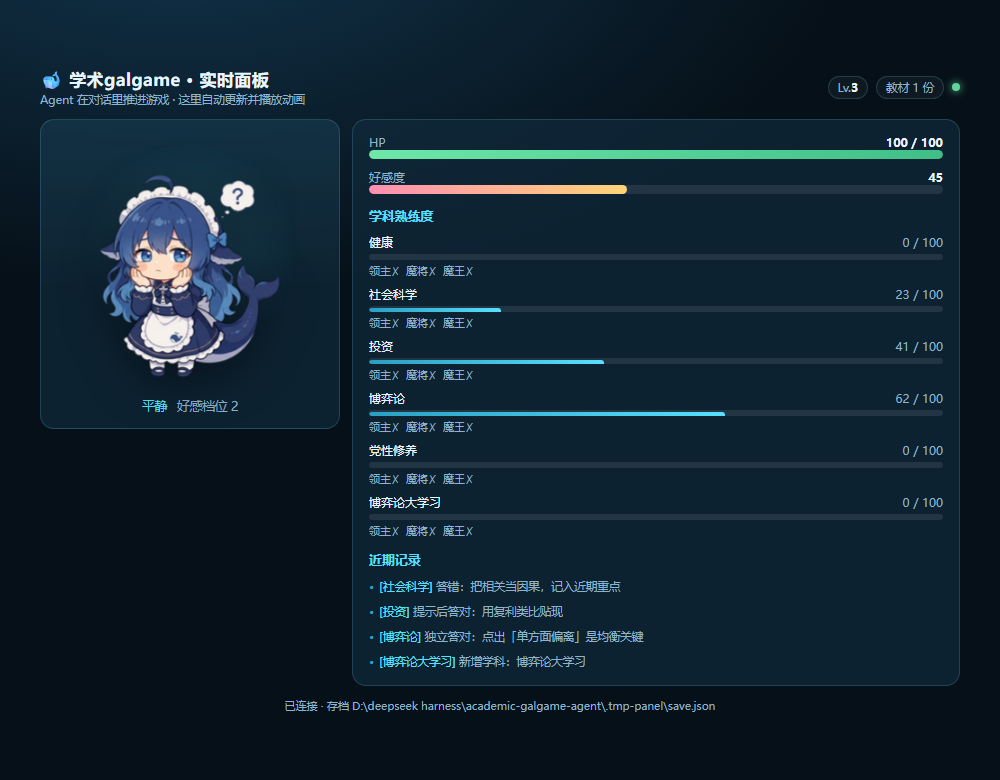

# 工作伙伴（WorkBuddy）版 · 学术galgame

把「学术galgame」做成 **WorkBuddy 技能包**：安装后，WorkBuddy 就变成一位**用苏格拉底式提问教学**的鲸鱼娘老师，
每次判定都会写进学科熟练度与好感度，达标后解锁领主 → 魔将 → 学科魔王的考试剧情。

> 与 Trae 版的区别：Trae 版是**一个完整项目**（带 Web UI，`.trae/rules` + `.trae/skills`）；
> WorkBuddy 版是**两个可安装的技能**，不含 UI，游戏状态由技能内嵌的 CLI 维护。

---

## 一、安装

### 方式 A：本地安装脚本（推荐，不依赖外网）

```powershell
# Windows
cd workbuddy
.\install.ps1
```

```bash
# macOS / Linux
cd workbuddy
chmod +x install.sh && ./install.sh
```

脚本会把 `skills/` 下的两个技能复制到 **`~/.workbuddy/skills/`**：

```
~/.workbuddy/skills/
├── academic-galgame/          # 主技能：鲸鱼娘老师 + 游戏状态 CLI + 教材库 + ima + 动画面板
│   ├── SKILL.md
│   ├── scripts/
│   │   ├── galgame.js         # 状态 CLI（status/onboard/panel/apply/battle/materials/ima/llm/judge/retrieve）
│   │   ├── panel.js           # 实时动画面板服务（零依赖 HTTP，与 CLI 共用存档）
│   │   ├── materials.js       # 教材库：导入 / 列表 / 学科标注 / 检索
│   │   ├── ima.js             # ima 知识库：凭证 / 列库 / 绑定 / 检索（必填项）
│   │   ├── llm.js             # LLM：自备 OpenAI 兼容 API + 判分（可选项）
│   │   ├── creds.js           # 本地凭证读写（ima 与 LLM 共用一份，权限 0600）
│   │   ├── extract.js         # 文本提取（.md/.txt/.docx/.pdf，零依赖）
│   │   └── engine/            # 内嵌游戏引擎（状态机 / 战斗 / 配置）
│   ├── panel/index.html       # 面板页面（立绘逐帧动画 / 数值变化高亮 / 战斗浮层）
│   ├── assets/whale-girl/     # 鲸鱼娘 15 张立绘精灵图
│   └── references/
│       └── game-design.md     # 完整数值表
└── socratic-questioning/      # 提问框架技能（六类提问 / 五种策略）
    └── SKILL.md
```

> 仓库里的 `workbuddy/` 目录还带 `install.ps1` / `install.sh`（安装）与
> `sync-engine.ps1` / `sync-engine.sh`（把主项目引擎同步进技能包）。

### 方式 B：生态 CLI 安装（需要能访问 GitHub）

```bash
npx skills add <owner>/<repo>@academic-galgame -g -y
```

### 安装后确认

```bash
ls ~/.workbuddy/skills/            # macOS / Linux
dir %USERPROFILE%\.workbuddy\skills  # Windows
```

应能看到 `academic-galgame` 与 `socratic-questioning` 两个目录。

---

## 二、使用

打开 WorkBuddy，直接说需求即可（技能会自动匹配）：

```
开始教学，我想学纳什均衡
考考我博弈论
看看我的学习进度
加一门「博弈论大学习」
我想挑战领主
```

也可以 **@技能名** 手动触发：

```
@academic-galgame 看看我的进度
@socratic-questioning 帮我用提问的方式想清楚这个选题
```

### 它会怎么教

1. 先 `status` 读进度，决定今天教什么；
2. **若你还没配 ima 知识库**（`setup.needed: true`），它会**主动告诉你这是必填项**，
   并给出拿 Key 的步骤（ima.qq.com → 开放平台 / API → API Key + Client ID）；
   （这一步它不会跳过，因为**没有依据就不该开始教**）
3. **抛一个具体情境**（例如「两片渔场，限量还是疯狂捕捞？」），**不直接讲定义**；
4. 按六类提问逐层追问；你卡住时给 1~2 档提示，答错则降难度并把该点记入近期重点；
5. **每次判定立刻写进游戏数值**（熟练度 / 好感度 / 心情）；
6. 达标时提示可以挑战领主 / 魔将 / 学科魔王。

> 想单独看这份引导：`node $SKILL onboard`

---

## 二·三、只需要连两样东西

这是这个技能包**对外部世界的全部依赖**：

| 连接 | 是否必填 | 说明 |
|---|---|---|
| **① ima 知识库 API** | **必填** | 出题唯一的**真实依据来源**。技能里**没有内置语料**，不配就只能在开场如实说明「暂时没有你的资料」。 |
| **② LLM** | **二选一 / 可不填** | **不填** = 用 **WorkBuddy 自己的积分**（默认）：讲解、出题、判分都由 WorkBuddy 自己的模型做。<br>**填了** = 技能自己调一个 OpenAI 兼容 API（火山方舟 / DeepSeek / OpenAI…），省你的 token 或指定更强的模型。 |

本地教材（`materials`）是**可选加料**，用来补 ima 里没有的资料，**不替代 ima**。

拿到 ima 的 API Key 与 Client ID：**https://ima.qq.com** → 左下角头像 → 开放平台 / API（`ima.qq.com/developer`）。

---

## 二·五、实时动画面板（**不要只有文字**）

WorkBuddy 是对话式 Agent，但 galgame 的手感需要**看得见**。面板跟 CLI **共用同一份存档**：
你在对话里推进游戏，浏览器里的鲸鱼娘就**实时动起来**。



```bash
node $SKILL panel --port 8790        # 长驻进程 → 后台运行
# 打开 http://127.0.0.1:8790
```

| 面板会动的地方 | 说明 |
|---|---|
| **立绘逐帧动画** | 15 张精灵图，按心情/好感档位切换，每张 1~3 帧循环播放 |
| **数值变化高亮** | HP / 好感度 / 等级变化时**闪绿（涨）或闪红（跌）**，数字带渐隐光晕 |
| **立绘反馈** | 好感涨 → 鲸鱼娘**跳一下**；跌 → **低头摇晃** |
| **血条** | 宽度平滑过渡；HP ≤ 30% 变红并**脉动闪烁** |
| **战斗浮层** | 敌 HP 减少时**震屏**；魔神显示 ∞ |
| **学科列表** | 新学科**淡入**；熟练度条平滑增长；任务链 ✓/✗ |
| **近期记录** | 新条目自上而下淡入 |

**使用要点**：
- `panel` 是**长驻 HTTP 服务**，不会自己退出 —— 必须后台运行，别阻塞对话；
- 面板每 **0.8 秒**自动拉一次状态，**Agent 不需要为它做任何额外操作**，照常调 `apply` / `battle-*` 即可；
- 端口被占用换一个（`--port 8791`）；`GALGAME_PANEL_PORT` 也可指定默认端口。

---

## 三、游戏状态 CLI

技能通过这个 CLI 读写全部游戏状态（输出 JSON，便于智能体解析）：

```bash
SKILL=~/.workbuddy/skills/academic-galgame/scripts/galgame.js

node $SKILL status
node $SKILL apply --subject 博弈论 --mastery 13 --favor 9 --mood joy --note "独立答对"
node $SKILL add-subject --name "博弈论大学习"
node $SKILL remove-subject --name "投资"
node $SKILL battle-start --subject 博弈论 --enemy lord
node $SKILL battle-apply --correctness 0.8
node $SKILL battle-retreat
node $SKILL reset
node $SKILL help
```

| 命令 | 说明 |
|---|---|
| `status` | 等级 / HP / 好感度 / 各科熟练度 / 任务链 / 进行中的战斗 / **ima + LLM + 教材库 + 首次引导** |
| `onboard` | **首次使用引导**：必填项还差什么（逐条列出 ima / LLM / 本地教材的状态与做法） |
| `apply` | 教学结算：`--subject` 必填，`--mastery` `--favor` `--hp` `--mood` `--note` 可选 |
| `judge` | 判分：`--subject` `--question` `--answer` `[--points "要点1;要点2"]` → 正确度 0-100 + 盲点 + 追问 |
| `add-subject` / `remove-subject` | 增删学科（至少保留一个） |
| `battle-start` | 开战；`--enemy` = `lord` / `general` / `king` / `demon` |
| `battle-apply` | 结算一次攻击；`--correctness`（0~1）、`--damage-enemy`、`--damage-self` |
| `battle-retreat` | 撤退，清战斗态，无惩罚 |
| `reset` | 重置全部进度 |

**存档位置**：`~/.workbuddy/academic-galgame/save.json`（可用环境变量 `GALGAME_SAVE` 覆盖）
存档里同时保存**战斗态** —— 因为 CLI 每次调用都是独立进程。

---

## 三·五、教材库（让老师有真实依据，不编造）

老师出题前会先 `retrieve`，用**你自己导入的资料**作为依据：

```bash
# 导入（支持 .md / .txt / .docx / .pdf；可传单个文件或整个目录）
node $SKILL materials add --path D:\我的笔记\博弈论.md --subject 博弈论
node $SKILL materials add --path D:\我的讲义            --subject 投资
node $SKILL materials add --path D:\通用资料.md                      # 不填学科 = 通用

node $SKILL materials list                                  # 看已导入的教材
node $SKILL materials set-subject --name 博弈论.md --subject 健康   # 改学科
node $SKILL materials remove --name 博弈论.md                # 删一份
node $SKILL materials clear                                 # 清空

node $SKILL retrieve --query "纳什均衡" --subject 博弈论       # ★ 检索真实片段
```

| 要点 | 说明 |
|---|---|
| **格式支持** | `.md` / `.txt`（直读）、`.docx`（解 ZIP 取正文）、`.pdf`（**实验性**，扫描件/特殊字体会失败并给出提示） |
| **学科语义** | 教材标了学科 → **只**在该学科可用；留空 → **通用**，所有学科可用；该科无可用教材时如实返回空，不会误用别的学科 |
| **目录批量** | `--path` 传目录会递归导入（最多 5 层） |
| **同名覆盖** | 再次导入同名文件 = 更新 |
| **检索机制** | 按 Markdown 标题切小节 → 中英文字符/双字组合打分 → 返回命中最高 3 段 |
| **存储位置** | `~/.workbuddy/academic-galgame/materials/`（`index.json` + `<id>.txt`，可用 `GALGAME_MATERIALS` 覆盖） |

> 导入时**一次性提取文本**并存下来，之后检索直接读，不会每次重新解析原文件 —— 原文件移动/删除也不影响。

---

## 三·六、ima 知识库（**必填 —— 出题的唯一真实依据来源**）

这个技能包**不含任何内置语料**：所有引用都必须来自**你自己的 ima 知识库**。
每个知识库能**一键变成一门学科**。

```bash
node $SKILL ima status                                        # 是否已配置（Key 打码显示）
node $SKILL ima config --key <API Key> --client-id <Client ID> # 保存凭证
node $SKILL ima test                                          # 连通性自检
node $SKILL ima kbs                                           # 列出你的知识库（名称 → ID）
node $SKILL ima add-subject --kb "博弈论大学习"                 # ★ 一键变成学科并绑定
node $SKILL ima bind --subject 博弈论 --kb "博弈论大学习"        # 给已有学科绑定知识库
node $SKILL ima unbind --subject 博弈论                        # 解除绑定
node $SKILL ima clear                                         # 清除凭证与全部绑定
```

**API Key 与 Client ID 从哪来**：**https://ima.qq.com** → 左下角头像 → 开放平台 / API（`ima.qq.com/developer`），
两个都要填。

典型对话：

```
用户：用我的「博弈论大学习」知识库教我
你  ：ima kbs → ima add-subject --kb "博弈论大学习" → retrieve --query 纳什均衡 --subject 博弈论大学习
      → 用检索到的真实内容出题
```

| 要点 | 说明 |
|---|---|
| **凭证存放** | `~/.workbuddy/academic-galgame/credentials.json`，**只存本机**，写入时权限 `0600`（Windows 忽略） |
| **环境变量优先** | `IMA_API_KEY` / `IMA_CLIENT_ID` / `IMA_KB_MAP` 会覆盖文件里的值（适合 CI 或临时用法） |
| **域名可改** | `GALGAME_HOME` 可改整个凭证/存档目录 |
| **未配置时** | `setup.needed = true`，技能**开场就会如实告诉用户必填项没做**，不会空讲 |
| **检索接口** | `get_addable_knowledge_base_list` → `search_knowledge` → `get_media_info` → 取正文（每段截 1200 字） |

---

## 三·七、LLM（**可选，二选一**）

**默认什么都不用填。** 不配就是「**WorkBuddy 积分模式**」：讲解、出题、判分全部由
**WorkBuddy 自己的模型**完成 —— 不消耗额外 key，也不需要对任何第三方 API 付费。

想让技能自己调一个模型（省 WorkBuddy 的积分额度，或用更强/更便宜的模型判分）才需要配：

```bash
node $SKILL llm status                                        # 看现在是「自备 API」还是「WorkBuddy 积分」模式
node $SKILL llm config --key <Key> [--model <模型>] [--base-url <地址>]   # 任何 OpenAI 兼容接口
node $SKILL llm test                                          # 连通性自检
node $SKILL llm clear                                         # 清空自备 API，回到 WorkBuddy 积分模式
```

| 服务 | `--base-url` | 说明 |
|---|---|---|
| **火山方舟**（默认） | `https://ark.cn-beijing.volces.com/api/v3` | `--model` 填推理接入点 ID（`ep-...`）或模型名 |
| **DeepSeek** | `https://api.deepseek.com/v1` | `--model deepseek-chat` |
| **OpenAI** | `https://api.openai.com/v1` | `--model gpt-4o-mini` 等 |
| **其它兼容服务** | 服务商给的 `/v1` 地址 | 只要兼容 `/chat/completions` 即可 |

| 要点 | 说明 |
|---|---|
| **默认值** | base `https://ark.cn-beijing.volces.com/api/v3`，model `deepseek-v3-250324` |
| **环境变量优先** | `LLM_API_KEY` / `LLM_MODEL` / `LLM_BASE_URL` |
| **与 ima 共用凭证文件** | 同一个 `credentials.json`，互不干扰 |
| **判分** | `judge` 在**自备 API 模式**下由模型给 `correctness` / `blindspots` / `nextQuestion`；<br>在 **WorkBuddy 积分模式**下返回 `needsAgentJudgement: true`，**由 WorkBuddy 自己判**，再调 `apply` 结算 |

> 无论哪种模式，**游戏结算始终走同一个 `apply` / `battle-apply`** —— 数值不会因为模式不同而不一致。

### 检索优先级（教材库 → ima）

```bash
node $SKILL retrieve --query "纳什均衡" --subject 博弈论大学习
```

1. 先查**本地教材库**（该学科 + 通用）—— 命中即返回，`source: "materials"`
2. 没命中再查**ima 知识库**（该学科绑定的那个）
3. 两边都没有 → `ok:false`，并分别给出 `materialsError` / `imaError` 与 `hint`

---

## 四、自检（不依赖 WorkBuddy，直接用 CLI 验证）

```bash
SKILL=~/.workbuddy/skills/academic-galgame/scripts/galgame.js
export GALGAME_SAVE=/tmp/galgame-test.json          # 用临时存档，别污染真实进度
export GALGAME_MATERIALS=/tmp/galgame-test-materials # 用临时教材库

node $SKILL status
node $SKILL apply --subject 博弈论 --mastery 60
node $SKILL battle-start --subject 博弈论 --enemy lord
node $SKILL battle-apply --correctness 0.8
node $SKILL status      # 应看到：领主✓、熟练度 +3、好感 +2

# 教材库自检
printf '# 纳什均衡\n\n均衡指任何一方单独改变策略都不会更好。\n' > /tmp/t.md
node $SKILL materials add --path /tmp/t.md --subject 博弈论
node $SKILL retrieve --query 纳什均衡 --subject 博弈论   # ok=true，能看到上面那句话
node $SKILL retrieve --query 纳什均衡 --subject 健康     # ok=false（该科无可用教材）

# 两条连接自检
node $SKILL onboard                    # 看 setup.requirements：ima 必填那条 done 了吗
node $SKILL ima test                   # 未配置 → ok:false，并提示先 ima config（这就是必填项没做）
node $SKILL llm test                   # 未配置 → ok:true（WorkBuddy 积分模式，属正常）
node $SKILL judge --subject 博弈论 --answer "均衡就是谁都不想单独改" --points "单方面偏离"
                                       # 未配自备 API → needsAgentJudgement:true（由 Agent 自己判）
```

---

## 五、数值速查

| 档位 | 熟练度 | 好感度 | 心情 |
|---|---|---|---|
| 独立答对 | +12 ~ +15 | +8 ~ +10 | `joy` |
| 提示后答对 | +6 ~ +9 | +4 ~ +6 | `think` |
| 答错 | 0 或小降 | 微降或 0 | `disappointed` |

| 敌人 | HP | 解锁条件 | 奖励（熟练 / 好感） |
|---|---|---|---|
| 领主 | 无血条（正确度 ≥ 0.6） | 熟练度 ≥ 60 | +3 / +2 |
| 魔将 | 15 | ≥ 75 且领主已完成 | +5 / +4 |
| 学科魔王 | 25 | ≥ 90 且魔将已讨伐 | +8 / +6（★） |
| 魔神 | ∞ | 全科魔王通关 | 0 / +1（暗线） |

完整数值见 `skills/academic-galgame/references/game-design.md`。

---

## 六、卸载

删除技能目录即可（存档保留，想彻底清掉再删存档）：

```powershell
Remove-Item "$HOME\.workbuddy\skills\academic-galgame" -Recurse -Force
Remove-Item "$HOME\.workbuddy\skills\socratic-questioning" -Recurse -Force
Remove-Item "$HOME\.workbuddy\academic-galgame" -Recurse -Force
```

---

## 七、与主项目的关系

| | Trae 版（主项目） | WorkBuddy 版（本目录） |
|---|---|---|
| 形态 | 完整项目：Node 服务 + Web UI | 两个技能包（无 UI） |
| 教学引擎 | `src/engine/` | `skills/academic-galgame/scripts/engine/`（同步副本） |
| 界面 | galgame Web 界面（立绘 / 属性面板 / 战斗浮层） | **本地实时动画面板**（`panel` 命令）+ 对话 |
| 触发方式 | 打开网页 | WorkBuddy 自动匹配或 `@技能名` |
| 模型来源 | 用户自带火山方舟 Key | **WorkBuddy 自身模型/积分**（默认），或 `llm config` 填自备 OpenAI 兼容 API |
| **教材来源** | 拖拽上传 `.md/.docx`（IndexedDB 持久化）+ **ima 知识库** | **ima 知识库（必填）** + `materials add` 本地文件/目录（可选加料） |
| 学科来源 | 从 ima 知识库**一键添加为学科**，或手动 | **`ima add-subject`** 一键从知识库建科，或手动 `add-subject` |
| 检索回落 | 上传教材 → ima → 内置示例语料 | 本地教材库 → ima（**没有内置语料**，两边都没有就如实说明） |

> ⚠️ `scripts/engine/` 与 `assets/whale-girl/` 都是从主项目**同步的副本**（技能必须自包含）。
> 改动主项目后，用同步脚本更新，不要手抄：

```powershell
.\sync-engine.ps1            # 同步（hash 比对 → 只复制变化的 → 复验一致）
.\sync-engine.ps1 -Check     # 只校验，不一致则退出码 1（可挂进 CI）
```
```bash
./sync-engine.sh             # macOS / Linux
./sync-engine.sh --check
```

同步脚本管两组：

| 组 | 源 | 目标 | 范围 |
|---|---|---|---|
| **引擎** | `src/engine/` | `scripts/engine/` | `config.js` / `game.js` / `battle.js`（`storage.js`/`session.js` 是服务端专用，不进技能包） |
| **立绘** | `src/web/assets/whale-girl/` | `assets/whale-girl/` | 全部 PNG（15 张，约 2.25 MB） |
